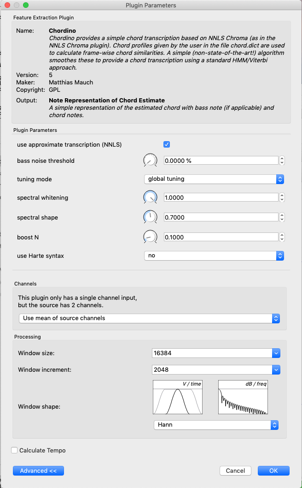
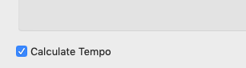
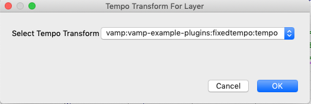
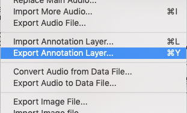

# sonic-visualiser-tweak
tweak adds ability to calculate/export tempo w/MIDI annotation layers
## sonic visualiser
[Sonic Visualiser](https://github.com/sonic-visualiser/sonic-visualiser) is a really usefull "program for viewing and analysing the contents of music audio files," 
developed by Chris Cannam, Christian Landone, and Mark Sandler in the Centre for Digital Music at Queen Mary, University of London.  
Please see these links for more information:
* Home Page and Downloads: [sonicvisualiser.org](http://www.sonicvisualiser.org/)
* Code Project: [code.soundsoftware.ac.uk](https://code.soundsoftware.ac.uk/projects/sonic-visualiser)
The program allows you to run "feature-extraction plugins to calculate annotations automatically, using algorithms such as beat trackers, 
pitch detectors, and so on."  You can checkout some of these plugins here:
* VAMP Plugins: [vamp-plugins.org/](http://www.vamp-plugins.org/)

A personal VAMP-plugin-favorite of mine is Mauch, Matthias, Dixon, Simon's [chordino](https://github.com/shidephen/chordino).  It's the most accurate and best 
audio-to-MIDI tool I've encountered, maybe there are some new Deep-Learning based tools now but nothing could beat chordino five years ago.  [chordino](https://github.com/shidephen/chordino)
allows the use of custom chord dictionaries.  I've included some of mine along with a numbers spreadsheet useful for calculating them in the folder chord.dicts.

*"Hey melodyne!, Hey ableton!, Hey commercial music software makers!, Please learn a lesson from these SV folks: 
the odds are if the results aren't simple diatonic chords and are instead dissonant clouds of chromatic nano-second-length 128th notes sounding harmonics higher 
in pitch than the highest note on a piano, those results are neither accurate nor usefull as MIDI information!"*.  

## tweak explanation
There is plenty about our tweaks of SV's source that remains incomplete--viz., the ability to convert "edit layer data" window data into  MIDI, the integration of [ARSS](https://github.com/derselbst/ARSS)--
however, Mo Kanan and I did manage to complete our tweak to the "Plugin Parameters" window in SV, which allows the calculation/export of tempo with MIDI annotation layers.  We did this over a year ago, but only I'm just uploading it now for anyone who wants the feature (maybe SV has it now, I don't know!):

The new checkbox in the bottom left corner of the "Plugin Parameters" window:

If the checkbox is checked when the plugin is run it triggers a second window which allows you to choose a tempo analysis plugin:

Export the annotation layer as you normally would and the MIDI file will have the calculated tempo rather than the default 120 BPM.

## future

I'll try and send a link to this tweak to Cannam, et. al, see if they might want to integrate it into SV or anything.  For the moment, the tweaked source along with an 
an installer for OSX will be included here.  When I get a chance I'll compile it on a PC and include the installer for that above too! 

